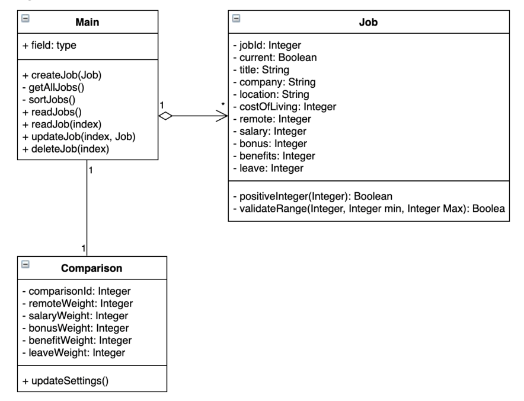
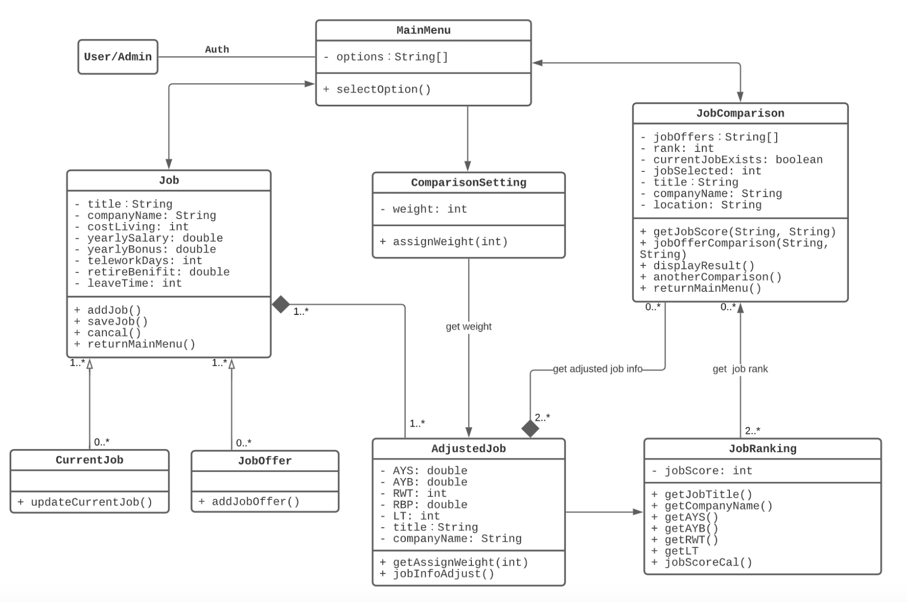
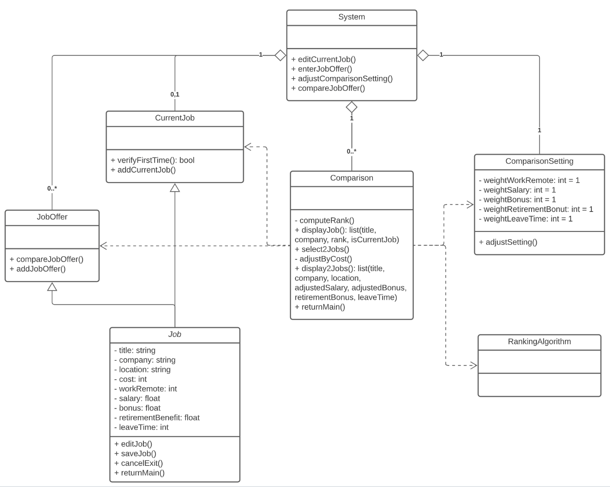
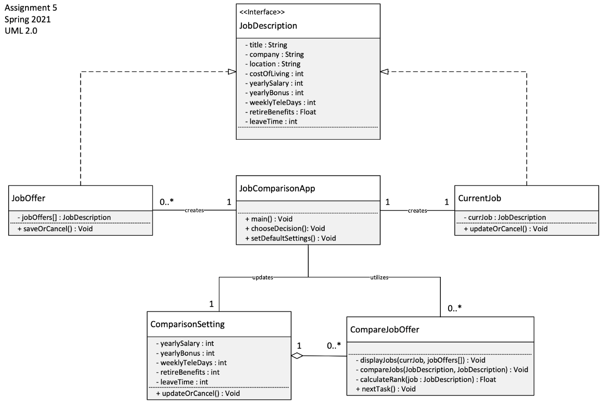

# Discussion Document
**Authors**: Vincent Hu, Sarah Kidd, Wenjuan Li, Ying Zhou
## Design 1

### Pros:
* This design handles the provided requirements with a minimalistic design.
    - A minimalistic design is easier to develop, manage, update, etc.
    - This design avoids duplicate functionality.
* No wasted storage: this design does not cache calculations. That means that there will not be any outdated data within the application. If the user changes their comparison weights often, this design is more efficient than a design that stores each calculation.
* The current design will easily allow for developers to add multiple comparison weights. With this design, you can switch from a 1-to-1 relationship to multiplicity easily.

### Cons:
* The main class is doing too much work in this design and is not very object oriented. There should be an additional driver class that aggregates _Job_ which should be placed between the Main class and other classes.
* This design will need to run calculation every time that it is requested, since the data isn't cached. If the user doesn't change their comparison weights very often, then this could be inefficient at run time.
* This design places the entirety of the navigation system within the GUI. That means that this design will require more work to be done on the front end. For example: duplication of data validation from both the GUI and data processing perspective.
* The relationship between _Job_ and _Main_ wouldn't really work when actually coded.

## Design 2

### Pros:
* This design makes clear class distinctions based on the options from the main menu.
* This design caches the ranking values in the _AdjustedJob_ class. If the user doesn't change their comparison weights very often, this approach is more efficient than constantly recalculating the values.
### Cons:
* Just because the main menu offers different functions, does not mean that each option on the main menu requires its own class. Some of these classes do not do very much.
    - Having too many classes makes it harder to update the design. If each function is turned into a class, it is hard to maintain consistency when you need to add functionality to the application. If you want to add a few more functions, you need to add a class for each one to keep the design consistent.
* The classes seems to carry a state representation that might be better off handled within the GUI (`returnMainMenu()`).

## Design 3

### Pros:
* The design is relatively minimalistic while also satisfying the given requirements.
* The use of inheritance for the _JobOffer_ and _CurrentJob_ classes is clean. Overall this is a strong design.
### Cons:
* The fact that the _RankingAlgorithm_ class is completely empty is a good sign that this could be a function rather than a class.
* The System has an aggregation of the _ComparisonSetting_ class, but that aggregation is labeled as a 1-to-1 relationship. That seems confusing.

## Design 4

### Pros:
* The design is relatively minimalistic while also satisfying the given requirements.
* The use of the interface class, _JobDescription_, for the _JobOffer_ and _CurrentJob_ classes is clean. Overall this is a strong design.
### Cons:
* This design will need to run calculation every time that it is requested, since the data isn't cached. So if the user doesn't change their comparison weights very often, then this could be an inefficient implementation.
* Though utilizing an interface for this implementation could work, it may make more sense to turn the _JobDescription_ interface class into a super class where the _JobOffer_ and _CurrentJob_ classes would inherit from _JobDescription_.

## Team Design
This is the final design based on the team discussion; the design proposed is a combination of key features from each individual design. Each individual design captured the requirements, so they were incorporated into team design with minor adjustments. We came up with this final design by combining how we believed we would realistically code this application while also still utilizing OOP concepts.
Some classes, like _JobRanking_ and _AdjustedJob_ (Design #2), _RankingAlgorithm_(Design #3), and _JobComparison_ classes (Design #2, #3, #4), were eliminated from team design since _JobComparison_ is just for calculating the job rank, which can be handled by the `calculateRank()` method in _Comparison_ class of team design.
Some methods like `returnMainMenu()` (Design #2) and `returnMain()` (Design #3) were eliminated as well since these can be considered part of GUI implementation.
The _Job_ class (Design #1) was enhanced by splitting it into two inherited classes, _CurrentJob_ and _JobOffer_. This made sense, since the current requirements only allow a user to update the current job but not job offers.

In terms of design decisions, the team came to the following conclusions:
- The _Application_ class is the entry point to the system.
- To distinguish the _CurrentJob_ and _JobOffer_, the team decided to create two different classes and associate them to the _Application_ class.
- The adjusted job information (Requirement #6) will be handled by `calculateRank()` method.
- We implemented this design using OOP concepts.

## Summary
We learned that the discussions could have been more efficient if everyone had read through the assignment and spent time understanding each others' designs ahead of time.
We also learned about the importance of teamwork and collaboration. Although our team is comprised of members from different backgrounds, everyone was flexible with meeting schedules and was willing to express their thoughts, and provide suggestions during discussion. We also gained a better understanding of some UML concepts, like relationships and cardinality as we discussed how our team design should look. We saw that coming from different academic backgrounds was beneficial for the team during our team discussions, as we all had something different to add. We also learned a bit of how each of us worked through this assignment as we each talked through our design and explained why designed the application that way.
We also learned to strike a balance between an overly-detailed design and an overly-generic design. We believe we found a solid balance between these two extremes.
