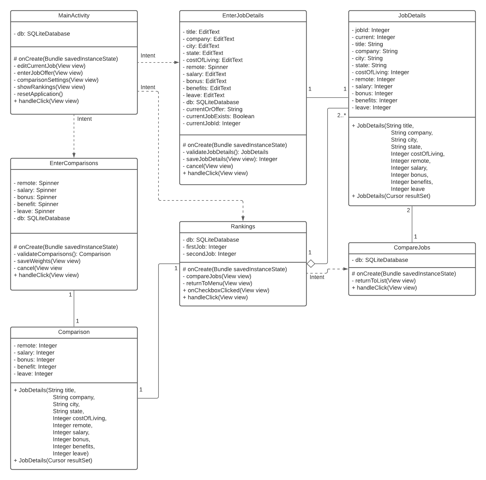

# Design Document

**Authors**: Vincent Hu, Sarah Kidd, Wenjuan Li, Ying Zhou

**Version** D3.0

## 1 Design Considerations

### 1.1 Assumptions
This application will support an Android emulator or Android phone that is at least a version 9.0 (Pie). It will be assumed that the user knows how to operate a touch screen, an on-screen keyboard, and can understand English. It will be assumed that there is enough memory available on the emulator or phone to operate the application and save additional data that the user may input into the application.

### 1.2 Constraints
The application may be constrained by the amount of memory or storage available.

### 1.3 System Environment
The application must run on an fully functioning Android emulator or Android phone. Both the Android emulator and Android phone must at least be of version 9.0 (Pie). The emulator targeted is a Pixel 3.

## 2 Architectural Design

### 2.1 Component Diagram

### 2.2 Deployment Diagram

## 3 Low-Level Design

### 3.1 Class Diagram

## 4 User Interface Design

