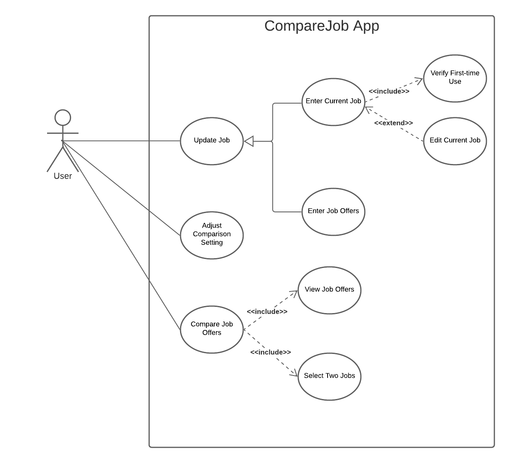

# Use Case Model

**Authors**: Vincent Hu, Sarah Kidd, Wenjuan Li, Ying Zhou

**Version** D3.0

## 1 Use Case Diagram

## 2 Use Case Descriptions

- Scenarios:

    1. Actor `User` adds current job details.
    * Requirements: `User` adds valid details for current job
    * Pre-conditions: `User` must have all the information about their current job
    * Post-conditions: `User` is returned to main menu
    * Scenarios: If any inputs are invalid, warning will help the user fix their input. If saved, the current job will be stored in a persistent SQLite database. If canceled, the updates will not be saved.

    2. The system allows Actor `User` to edit current job details if there is a current job.
    * Requirements: `User` updates valid details for current job
    * Pre-conditions: `User` must have all the information about their current job
    * Post-conditions: `User` is returned to main menu
    * Scenarios: If any inputs are invalid, warning will help the user fix their input. If saved, the current job will be stored in a persistent SQLite database. If canceled, the updates will not be saved.

    3. Actor `User` enters all details of job offers.
    * Requirements: `User` updates valid details for a job offer
    * Pre-conditions: `User` must have all the information about the job offer
    * Scenarios: If any inputs are invalid, warning will help the user fix their input. If saved, the job offer will be stored in a persistent SQLite database. If canceled, the updates will not be saved. If compared, job offer will be saved

    4. Actor `User` adjusts integer weights for five comparison variables.
    * Requirements: `User` adjusted integer weight for comparison variables

    5.  Actor `User` requests the system to display details of all jobs, including current job.
    * Requirements: `User` views all job titles and companies
    * Pre-conditions: There must be at least two job details saved in the database. At minimum, the current job and one job offer, or two job offers.

    6. Actor `User` selects two jobs and the system displays details of the two jobs for comparison.
    * Requirements: `User` selects two jobs from job list and displays the details fo those jobs
    * Pre-conditions: `User` must select exactly two jobs
    * Post-conditions: `User` is able to view the details for the two chosen jobs
    * Scenarios: If only one job is chosen, `User` cannot continue to details screen. If more than one job is chosen, `User` cannot continue to details screen.
