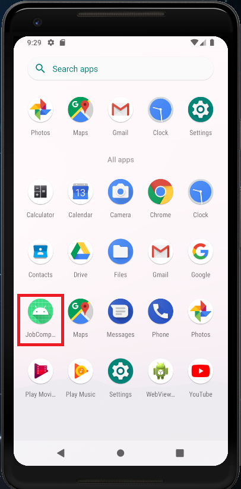
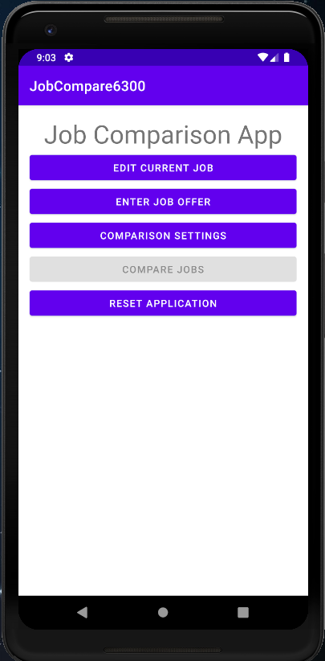
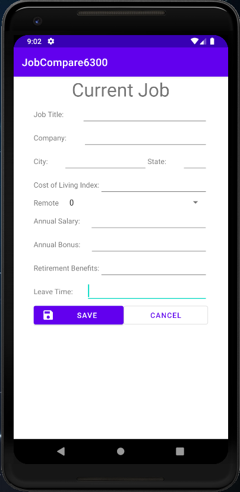
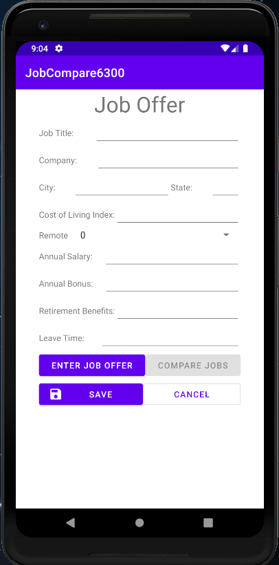
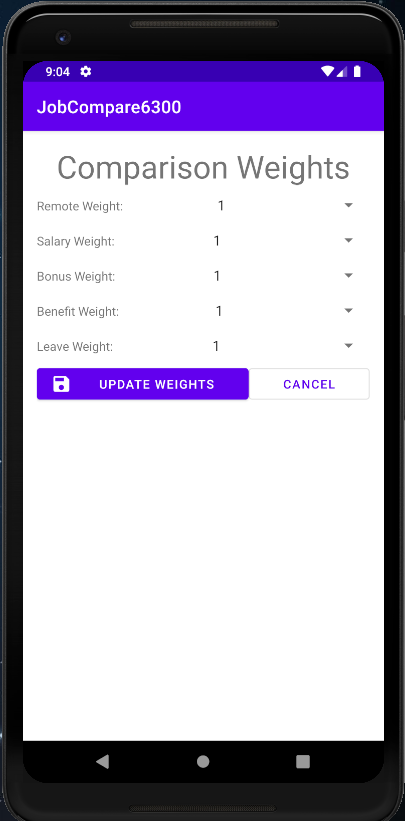
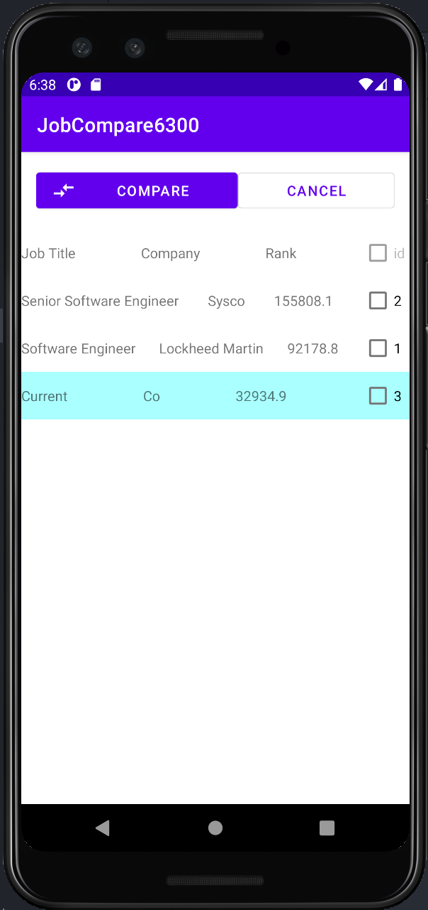
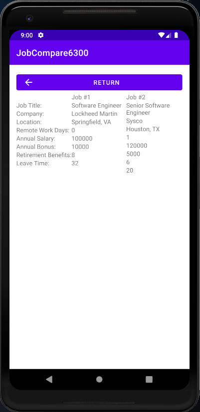
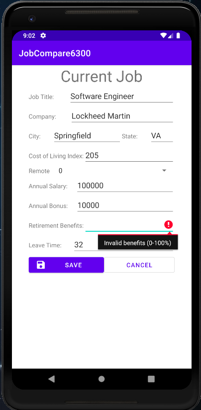

# JobCompare6300 User Manual

**Authors**: Vincent Hu, Sarah Kidd, Wenjuan Li, Ying Zhou

**Version** D3.0

## Application Description
I guess you are here because you got job offers recently, Congrats! 
Are you confused or even frustrated when compare different job offers, considering the salary, benefits, locations,etc.   
Don't worry, this app will take care of everything for you. Welcome to the job comparison app JobCompare6300!

It is designed to compare job offers with below major functionalities:
  - Enter or edit current job details
  - Enter job offers
  - Adjust the comparison settings
  - Compare job offers

## Usage Instructions
Below is the high level description about how to use this app.

### App Setup
1. You can either use Android Simulator or Android device to launch this app.
   - The minimum API level for the app should be “API 28: Android 9.0 (Pie)”.
2. The repo can be cloned from [Team154 git repository](https://github.gatech.edu/gt-omscs-se-2021spring/6300Spring21Team154/tree/master/GroupProject/JobCompare6300/).

### Open the application
You will find the application in the application drawer and it will look similar to to something below:

### Main Menu
The very first time you open this application, you will see the following options:
* Edit Current Job
* Enter Job Offer
* Comparison Settings
* Compare Jobs
* Reset Application

**Note: Option "Compare Jobs" will be disabled if there are less than a total of 2 jobs available to compare.**

### Edit Current Job
Here you can input your current job. You must input the following:
* Job Title
* Company
* City
* State
* Cost of Living Index
* Remote
* Annnual Salary
* Annual Bonus
* Retirement Benefits
* Leave Time

When you are finished, you can push "Save" to save the current job details, or push "Cancel" to return to the Main Menu (without saving).

### Input Job Offer
This screen looks very similar to the "Edit Current Job", but with a few extra buttons.

### Comparison Weights
You can utilize this screen to adjust the weights below to your liking. A higher number means you value that aspect. A lower number means that aspect isn't something you care about as much. The number must be between 1 and 10 (inclusive). By default all weights will be set to 1.

### Jobs List
Here you see all job offers and your current job, sorted by rank, desending. The row in blue is the current job.

### Comparing Jobs
On this screen you will see the 2 jobs you selected, and you are able to compare them easily side-by-side.
When you are finish, you can push the "Return" button to return to the previous screen (Jobs List).

### Invalid Input
Some fields in this application require a specific format and requires input. When you try to save a job, input validation will occur. If an input is in an incorrect format, you will see a red icon to the right of that field with a tool tip that is explaining why the current input is incorrect.

Now, you can compare job offers based on your selection. Congrats!

**May you encounter any error when you use this app, please contact Team154.**
